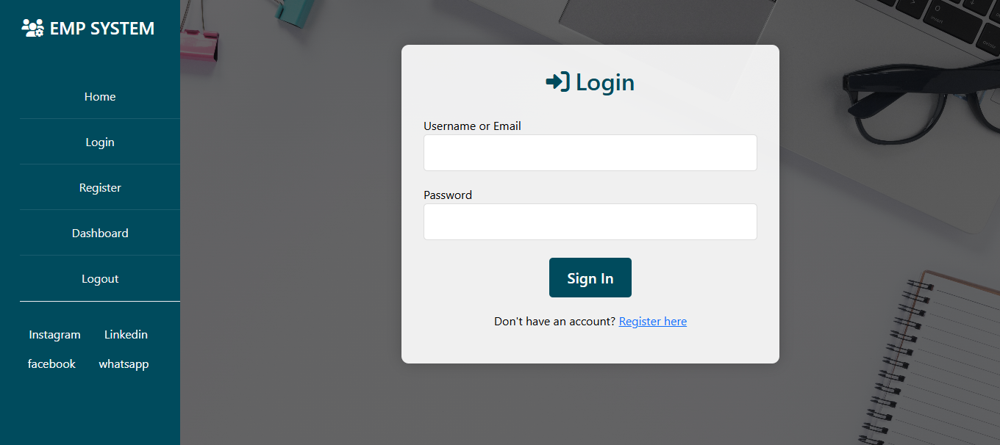
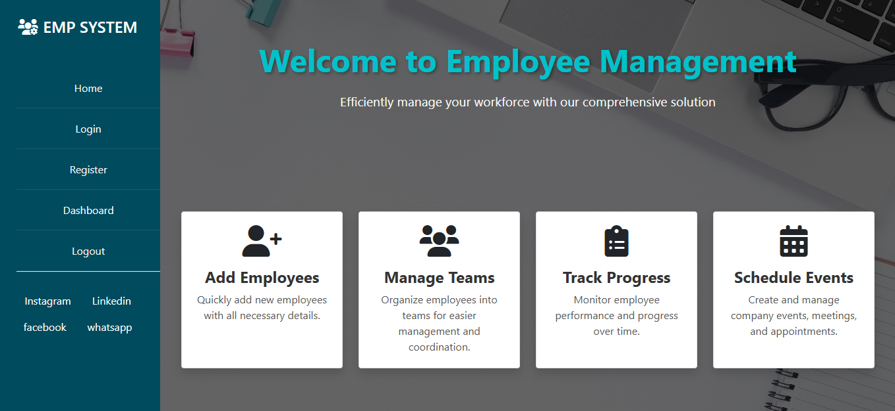
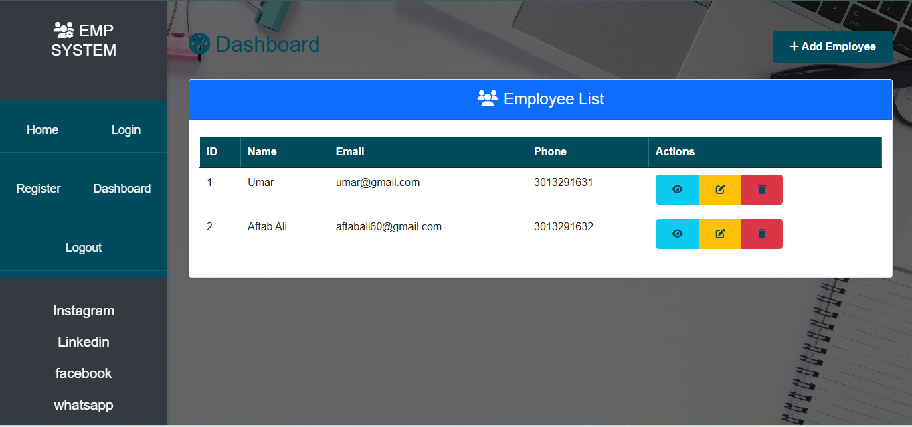
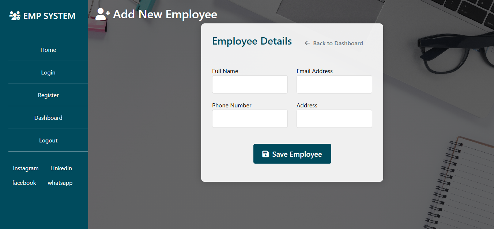
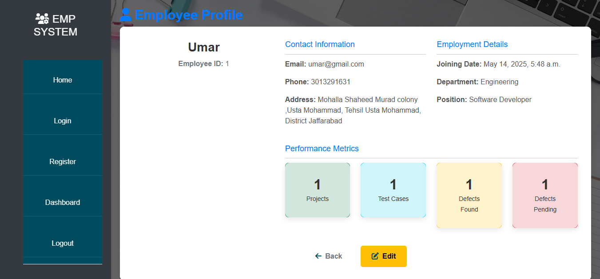
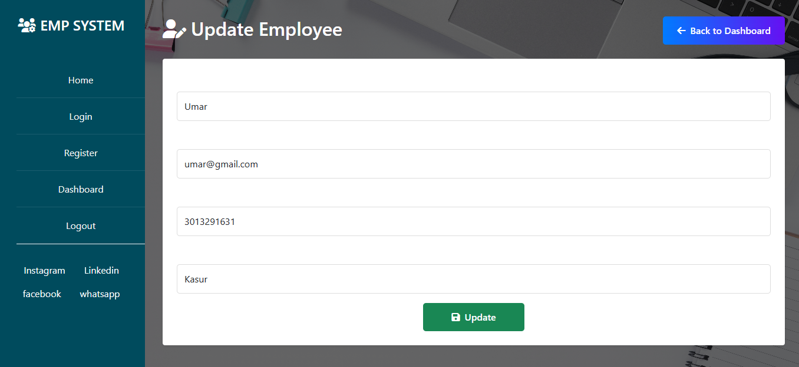

#  Employee Management System

A web-based Employee Management System built using **Django (Python)** with **HTML**, **CSS**, and **Bootstrap**. This system allows administrators to manage employee data including adding, updating, viewing, and deleting employee records.

---

##  Features

- User Registration & Login System
- Add New Employee
- View Employee List with Details
- Update Employee Info
- Delete Employee Record
- Admin Dashboard with Stats
- Responsive UI with Bootstrap

---

##  Screenshots of App


*Login View*


*Home View*


*Dashboard View*


*Add New Employee Page*


* Employee Profile*


* Update Employee View*

---


##  Tech Stack

- **Backend**: Django (Python)
- **Frontend**: HTML, CSS, Bootstrap
- **Database**: SQLite3
- **Tools**: Git, VS Code

---

##  Project Structure
<pre> ```
EMS/
│
├── App/
│ ├── models.py
│ ├── views.py
│ ├── templates/
│ └── static/
│
├── EMS/
│ ├── settings.py
│ └── urls.py
│
├── db.sqlite3
├── manage.py
└── README.md
  ``` </pre>

